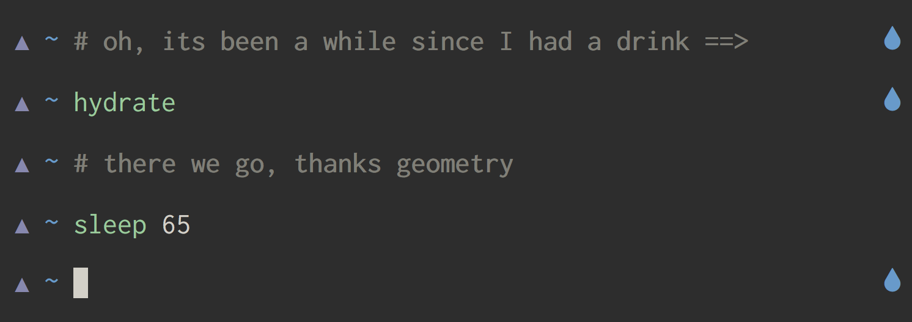

# Hydrate

Reminds you to hydrate every once in a while. Run `hydrate` once you have hydrated.



## Installation

```sh
GEOMETRY_PROMPT_PLUGINS+=(hydrate)
```

## Configuration

```sh
GEOMETRY_PLUGIN_HYDRATE_COLOR=blue
GEOMETRY_PLUGIN_HYDRATE_SYMBOL=💧
GEOMETRY_PLUGIN_HYDRATE_INTERVAL=20 # interval in minutes
```
